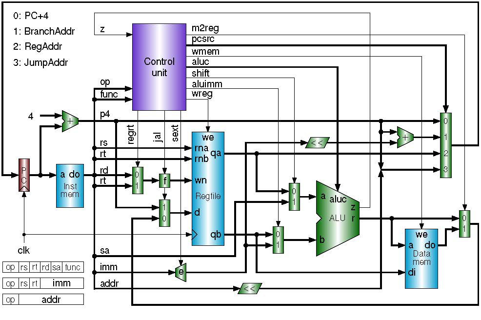

# RISC-V Single-Cycle Processor using Verilog HDL

## Overview

A single-cycle RISC-V processor implemented in Verilog HDL supporting a subset of the RV32I instruction set. The design includes a modular datapath, control unit, arithmetic logic unit (ALU), register file, instruction memory, data memory, and branch control logic.

## Features

- RV32I Single-Cycle Processor
- Arithmetic Logic Unit (ALU)
- Register File
- Program Counter
- Instruction Memory
- Data Memory
- Control Unit
- Sign Extender
- Branch Control Logic
- Functional Simulation

## Supported Instructions

- R-Type Instructions
- I-Type Instructions
- S-Type Instructions
- B-Type Instructions

## Processor Architecture

---

## Project Structure

- alu.v : Arithmetic Logic Unit
- control_unit.v : Instruction decoder and control logic
- register_file.v : 32 × 32 Register File
- instruction_memory.v : Instruction Memory
- data_memory.v : Data Memory
- sign_extender.v : Immediate Generator
- program_counter.v : Program Counter
- top.v : Top-level processor module
- alu_tb.v : Verification testbench

---

## Verification

The processor is verified through simulation by executing RV32I instructions including:

- Arithmetic operations
- Memory read/write operations
- Branch instructions
- Register write-back
- Program counter updates

---

## Tools Used

- Verilog HDL
- Vivado
- XSim

---

## Future Improvements

- Full RV32I instruction support
- Pipeline implementation
- Hazard detection
- Forwarding Unit
- Branch Prediction
- Interrupt support
- Cache Memory

---

## Author

Bhuvan Malhotra
